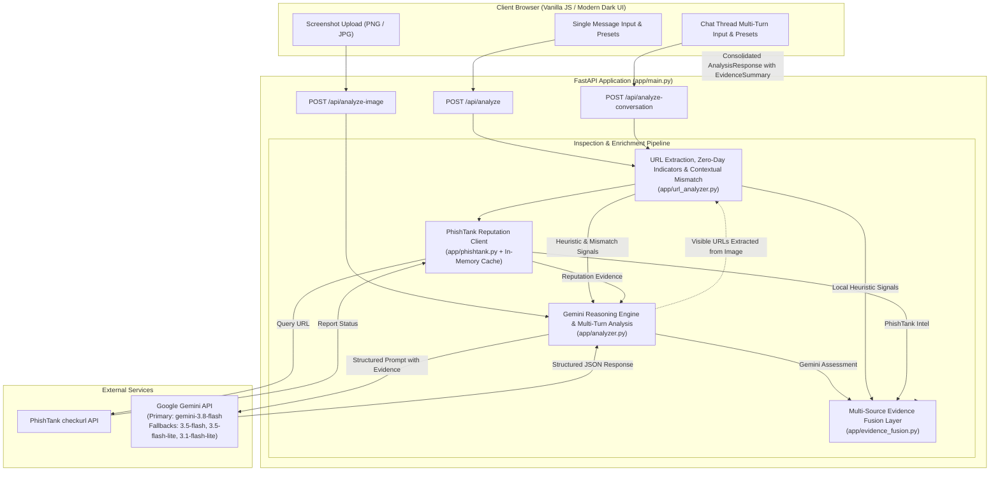

# ScamShield AI

**ForgeHacks 2026 Hackathon &bull; Track: AI + Cybersecurity**

ScamShield AI is an intelligent digital threat and fraud detection assistant. It combines deterministic local URL heuristic inspection, PhishTank reputation intelligence, and Google Gemini multimodal reasoning to protect users against digital scams, phishing, social engineering, and impersonation across SMS, email, messaging platforms, and screenshots.

---

## Problem Statement

Digital deception is evolving rapidly. Attackers exploit psychological pressure—fear of account suspension, false financial emergencies, simulated lottery wins, fake jobs, and delivery errors—to manipulate individuals into surrendering credentials, one-time passwords (OTPs), or direct payments (e.g., UPI, wire, gift cards).

Everyday users struggle to recognize sophisticated indicators such as:
- Lookalike or deceptively structured domains (e.g., `https://google.com@phishingserver.top/login`).
- Unencrypted HTTP authentication portals.
- Synthetic urgency and emotional manipulation tactics.
- Visual mimicry in screenshots from messaging apps (WhatsApp, Telegram, SMS, Instagram).

ScamShield AI bridges this gap with an intuitive, multi-layered defensive triage pipeline that evaluates suspicious content and explains threats in plain English.

---

## Key Features

- **Multi-Modal Inspection**: Analyze plain-text messages, multi-message conversation threads, and uploaded screenshots (`.png`, `.jpg`, `.jpeg`, `.webp`).
- **Multi-Message Conversation Analysis**: Analyzes chronological chat threads to detect cumulative social engineering patterns, including rapport/trust-building, escalating urgency, and payment/OTP demands (e.g., Pig Butchering and tech support grooming).
- **Zero-Day Phishing Structural Resilience**: Evaluates structural indicators that detect previously unseen phishing URLs without relying on pre-existing blacklists (punycode/IDN homographs, typosquatting character substitutions, non-standard ports, dynamic DNS/tunnels, and dangerous payload extensions). PhishTank is treated strictly as known-threat intelligence, and `NO_MATCH` is never treated as safe.
- **Sophisticated Contextual Mismatch Detection**: Identifies discrepancies between claimed organizations (e.g., Chase, IRS, Apple), sensitive requested actions, and destination domains (such as public Google Forms, Notion, or Canva docs) without requiring external web crawling.
- **Standardized Risk Triage**: Categorizes threats into three clear levels: `LOW`, `MEDIUM`, or `HIGH`.
- **Granular Threat Categorization**: Distinguishes primary digital fraud categories:
  - *UPI Payment Fraud*
  - *Bank/Financial Impersonation*
  - *Credential Phishing*
  - *Delivery Smishing*
  - *Fake Job Offer*
  - *Lottery/Prize Fraud*
  - *Government/Identity Impersonation*
  - *Friend/Family Impersonation*
  - *Tech Support Scam*
  - *Investment/Crypto Scam*
  - *Routine / Legitimate Communication*
- **Deterministic Multi-Source Evidence Fusion**: Transparently reconciles Gemini AI semantic reasoning, local deterministic URL heuristics, and PhishTank threat intelligence with explainable fusion rationale.
- **Concrete Indicator Extraction**: Itemizes red flags (e.g., artificial urgency, credential solicitations, suspicious TLDs, deceptive authority routing, contextual mismatches).
- **Actionable Guidance**: Delivers immediate, practical safety steps tailored to the detected risk.
- **Deterministic Local URL Security Analysis**: Automatically extracts URLs and runs rule-based heuristic checks without external latency.
- **PhishTank Reputation Verification**: Queries the official PhishTank database for community-verified phishing reports with an in-memory TTL cache.
- **Graceful Degradation Architecture**: If Gemini is temporarily down, the system does not crash; it preserves local URL analysis, PhishTank reputation lookups, and presents a degraded assessment.
- **Resilient AI Fallback Architecture**: Automatically handles transient API quota/concurrency issues (`503 UNAVAILABLE`, `429 RESOURCE_EXHAUSTED`) with exponential backoff retries and cascading model fallbacks.
- **Interactive Preset Scenarios**: One-click test scenarios in the UI for single messages and multi-turn conversations.

---

## System Architecture



---

## Detailed Analysis Workflows

### 1. Text Analysis Workflow

1. **Ingestion**: The user submits message text via `POST /api/analyze`.
2. **Local URL Parsing**: Any embedded URLs are extracted using regex patterns in `app/url_analyzer.py`.
3. **Deterministic Heuristics**: The local analyzer inspects protocol, domain structure, hyphens, and keywords.
4. **Reputation Lookup**: Extracted URLs are queried against PhishTank (`app/phishtank.py`).
5. **Contextual Enrichment**: Extracted URL indicators and PhishTank findings are appended to the Gemini prompt context.
6. **AI Analysis**: Gemini evaluates social engineering, linguistic pressure, and technical context, returning structured output.
7. **Evidence Fusion**: `app/evidence_fusion.py` synthesizes Gemini output, local heuristic flags, and PhishTank records to produce the final risk level, category, and transparent `EvidenceSummary`.
8. **Consolidated Output**: The UI renders the risk badge, category, evidence summary grid, explanation, indicator list, safe action, and dedicated URL evidence cards.

### 2. Screenshot / Image Analysis Workflow

1. **Upload & Validation**: The user uploads an image (`.png`, `.jpg`, `.jpeg`, `.webp`) up to 10MB via `POST /api/analyze-image`.
2. **In-Memory Handling**: Image bytes are processed in memory and never written permanently to disk.
3. **Multimodal Analysis**: The image is sent to Gemini with specialized vision instructions to extract visible text, detect visual cues (brand logos, fake security badges, countdown timers), and transcribe displayed URLs.
4. **URL Correlation**: Any URLs transcribed by Gemini are fed into the local URL analyzer and PhishTank client.
5. **Evidence Fusion**: Reconciles visual and textual AI findings with deterministic URL heuristics and reputation intelligence.
6. **Response Synthesis**: The structured response combines visual threat analysis, technical URL indicators, and multi-source evidence summary into a unified report.

### 3. Multi-Message Conversation Analysis Workflow

1. **Thread Ingestion**: The user submits an ordered sequence of message turns (with speaker roles such as Stranger, Victim, Support Agent) via `POST /api/analyze-conversation`.
2. **Global URL & Threat Aggregation**: All URLs across the entire dialog history are extracted, inspected for zero-day indicators and contextual mismatches, and checked against PhishTank.
3. **Trajectory & Grooming Analysis**: Gemini analyzes chronological manipulation tactics across turns:
   - Initial wrong-number or accidental-contact pretexts.
   - Rapid trust/rapport-building and identity probing.
   - Escalating urgency, legal threats, or artificial time pressure.
   - Final pivot to cryptocurrency investment, wire transfer, or OTP/credential demands.
4. **Conversation Tactics Extraction**: Evaluates specific boolean flags (`trust_building_observed`, `urgency_escalation_observed`, `payment_or_credential_demanded`) and summarizes the detected `grooming_pattern`.
5. **Degraded Mode Protection**: If the LLM is temporarily unreachable, deterministic heuristics evaluate multi-turn cues, ensuring users receive tactical fraud warnings even during API outages.

---

## Zero-Day Phishing & Structural URL Security Analysis

The local URL analyzer (`app/url_analyzer.py`) provides deterministic, offline-capable URL inspection designed to detect previously unseen (zero-day) phishing attacks:

- **Punycode / IDN Homoglyph Attacks**: Flags internationalized domain names prefixed with `xn--` designed to mimic legitimate brands using Cyrillic or Greek lookalike characters.
- **Typosquatting & Leetspeak Substitutions**: Detects character swaps (e.g., `0` for `o`, `1` for `l` or `i`, `rn` for `m`) impersonating target institutions (e.g., `paypa1-security.com`, `micros0ft-support.net`).
- **Non-Standard Web Ports**: Flags deceptive phishing URLs served on non-standard ports (e.g., `:8080`, `:8443`, `:8888`) commonly used by temporary phishing staging toolkits.
- **Dynamic DNS & Disposable Tunnels**: Identifies free DDNS and developer tunnel providers (e.g., `duckdns.org`, `ngrok-free.app`, `loca.lt`) frequently abused for zero-day phishing infrastructure.
- **Malicious Payload & Script Extensions**: Flags URLs pointing directly to executable, script, or archive payloads (e.g., `.exe`, `.scr`, `.bat`, `.iso`, `.vbs`).
- **Compromised CMS Paths**: Detects links targeting vulnerable WordPress or CMS directories (e.g., `/wp-content/plugins/`, `/wp-includes/`, `/admin/login.php`).
- **Open Redirect Parameters**: Identifies redirect chaining parameters (`?redirect=`, `?return=`, `?url=`, `?dest=`) that abuse legitimate websites as deceptive springboards.
- **Deceptive Userinfo Routing (`@`)**: Detects URLs where authority strings use the `@` symbol to obscure the destination host (e.g., `https://google.com@phishingserver.top/login`).
- **Target Brand Impersonation**: Checks for high-risk brand keywords (PayPal, Chase, Wells Fargo, Apple, Microsoft, Amazon, Netflix, IRS, Google) hosted outside official domains.
- **High-Risk TLDs**: Flags top-level domains frequently associated with bulk scam campaigns (`.xyz`, `.top`, `.click`, `.buzz`, `.cc`, `.tk`).

---

## Sophisticated Legitimate-Domain & Contextual Mismatch Detection

Attackers frequently host phishing forms on legitimate cloud infrastructure (e.g., Google Forms, Canva, Notion) or disguise links so the destination domain appears authentic. ScamShield AI implements contextual mismatch detection without crawling arbitrary websites:

- **Public Form Builder Mismatches**: Flags messages claiming to originate from banks, payment networks, or government agencies that direct users to public form builders (`forms.gle`, `docs.google.com/forms`, `notion.site`, `canva.site`, `typeform.com`, `forms.office.com`). Legitimate financial institutions never use public document tools for security or credential verification.
- **Cross-Brand & Unrelated Domain Redirection**: Detects instances where the message claims to represent Institution A (e.g., Bank of America, Chase), but directs the recipient to an unrelated external domain for sensitive account actions.
- **Government Authority Impersonation**: Detects messages claiming to represent the IRS, tax departments, or law enforcement where destination domains are not official government domains (`.gov` or `.gov.in`).
- **Evidence Fusion Escalation**: When a contextual mismatch is confirmed, Evidence Fusion elevates the risk level to `HIGH` even if the link is HTTPS-encrypted and not yet indexed in public threat blacklists.

---

## PhishTank Reputation Checking

The PhishTank integration (`app/phishtank.py`) queries the official PhishTank `checkurl` API:

- **Strict Threat Intelligence Role**: PhishTank is treated strictly as **known-threat intelligence**. It provides positive confirmation for cataloged threats, but `NO_MATCH` is never treated as proof of safety.
- **Verification Statuses**: Clearly distinguishes between:
  - **Known Phishing URL**: Verified community-confirmed threat (includes PhishTank ID and verification timestamp).
  - **Unverified Submission**: Listed in PhishTank database but pending community consensus.
  - **No Record Found**: URL is not indexed in the PhishTank database.
  - **Lookup Unavailable / Error**: Network or service failure (fails gracefully without breaking analysis).
- **Caching Layer**: Includes an in-memory TTL cache (15-minute expiration) to avoid redundant requests and respect rate limits.

---

---

## Multi-Source Evidence Fusion & Graceful Degradation

The deterministic evidence fusion layer (`app/evidence_fusion.py`) reconciles intelligence from all three inspection engines:

1. **Decisive Threat Intelligence**: If PhishTank flags `KNOWN_PHISHING`, the risk level is deterministically elevated to `HIGH` and categorized as `Credential Phishing`, overriding weaker signals.
2. **Local Heuristic Corroboration**: If local heuristics detect severe structural anomalies (e.g., deceptive `@` routing, raw IP hostnames, high-profile brand impersonation), risk cannot be `LOW`.
3. **PhishTank NO_MATCH Rule**: **Absence from PhishTank does NOT prove safety.** If PhishTank returns `NO_MATCH`, Gemini's risk evaluation and local red flags remain in full effect.
4. **PhishTank UNAVAILABLE Rule**: If the PhishTank service is unreachable or times out, the result is treated as **neutral evidence** (neither safe nor malicious), allowing local heuristics and Gemini to govern the verdict.
5. **Preserving AI Semantic Understanding**: Gemini's `HIGH` risk verdicts driven by social engineering, urgency tactics, or OTP extortion are preserved even when embedded URLs appear structurally clean or unindexed.
6. **Graceful Degradation**: If Gemini temporarily fails across all candidate models (quota exhaustion, transient 503/429, or network disconnect):
   - The application does not crash.
   - If URLs exist, deterministic local heuristics and PhishTank lookups execute fully.
   - The response clearly reports the available evidence in degraded mode with cautionary guidance.
7. **Internal Heuristic Confidence**: When displayed, confidence levels (e.g. `HIGH`, `MEDIUM`, `CAUTIONARY`) are **internal rule-based heuristic indicators** reflecting multi-source agreement, **not calibrated statistical probabilities**.

---

## Gemini AI Integration & Model Fallback Architecture

### Google GenAI SDK
ScamShield AI uses the modern `google-genai` SDK with strict JSON schema enforcement via Pydantic (`app/models.py`).

### Robustness & Fallback Chain
Free-tier and shared AI endpoints frequently face transient `503 UNAVAILABLE` and `429 RESOURCE_EXHAUSTED` conditions. ScamShield AI implements an automated, cascading resiliency strategy:

1. **Primary Model**: `gemini-3.8-flash`
2. **Exponential Backoff**: Up to 3 retries with jittered exponential delay on transient errors.
3. **Cascading Model Fallbacks**: If the primary model remains unavailable, the client systematically attempts:
   - `gemini-3.5-flash`
   - `gemini-3.5-flash-lite`
   - `gemini-3.1-flash-lite`
4. **Graceful Degradation**: If all models in the fallback chain are exhausted, the pipeline transitions seamlessly to the Evidence Fusion degraded mode instead of an unhandled crash.

---

## Technology Stack

- **Backend**: Python 3.10+ (tested on Python 3.13)
  - **FastAPI**: Asynchronous web framework
  - **Uvicorn**: High-performance ASGI server
  - **Pydantic v2**: Strict schema definition and response validation
  - **Google GenAI SDK**: Multimodal LLM integration
  - **HTTPX & Requests**: Clients for PhishTank API lookups
- **Frontend**:
  - **HTML5 & Vanilla JavaScript**: Lightweight, responsive single-page interface
  - **Vanilla CSS**: Custom glassmorphism dark-mode design system with responsive layouts
- **Testing & Benchmarking**:
  - `unittest`: Unit and regression test suite
  - Custom Evaluation Harness: `evaluation/evaluate.py`

---

## Project Folder Structure

```text
ScamShield-AI/
├── .env.example              # Environment variables template
├── .gitignore                # Protects secrets, virtualenv, and test artifacts
├── requirements.txt          # Python package dependencies
├── README.md                 # Complete project documentation
├── app/
│   ├── __init__.py
│   ├── config.py             # Settings, environment loading, and fallback model definitions
│   ├── models.py             # Pydantic schemas (AnalysisResponse, EvidenceSummary, UrlSignal, PhishTankResult)
│   ├── url_analyzer.py       # Deterministic local URL heuristics & extraction
│   ├── phishtank.py          # PhishTank API client with in-memory TTL cache
│   ├── evidence_fusion.py    # Multi-source evidence fusion & graceful degradation layer
│   ├── analyzer.py           # Gemini multimodal integration, retries, and fallbacks
│   └── main.py               # FastAPI application, route handlers, and static mounting
├── evaluation/
│   ├── dataset.py            # Synthetic benchmark dataset (30 messages, 20 URLs)
│   ├── evaluate.py           # Evaluation runner script with CLI flags
│   └── evaluation_results.json # Serialized evaluation metrics and confusion matrices
├── static/
│   ├── index.html            # User interface with evidence summary and multi-channel input
│   ├── style.css             # Glassmorphism dark-theme styling
│   └── app.js                # Frontend API client and dynamic result rendering
└── tests/
    ├── test_url_analyzer.py  # Unit and regression tests (including U10 deceptive @ routing)
    ├── test_evidence_fusion.py # Evidence fusion tests (known phish, unindexed, unavailable, degradation)
    └── test_robustness.py    # Zero-day phishing, contextual mismatch, and conversation tests
```

---

## Setup and Local Run Instructions

### 1. Prerequisites
- Python 3.10 or higher
- A Google Gemini API key from [Google AI Studio](https://aistudio.google.com/)

### 2. Clone and Configure Environment
Clone the repository and create your local `.env` file:

```bash
# Copy template
copy .env.example .env     # Windows
cp .env.example .env       # Linux / macOS
```

Open `.env` and configure your API key:
```env
GEMINI_API_KEY=your_actual_gemini_api_key_here

# Optional: PhishTank application credentials (works without a key in anonymous mode)
PHISHTANK_API_KEY=
PHISHTANK_USER_AGENT=ScamShieldAI-ForgeHacks2026
```

### 3. Set Up Virtual Environment & Dependencies

```bash
# Windows
python -m venv .venv
.\.venv\Scripts\activate
pip install -r requirements.txt

# Linux / macOS
python3 -m venv .venv
source .venv/bin/activate
pip install -r requirements.txt
```

### 4. Run Regression Tests

Verify the local deterministic engine, regression cases, and evidence fusion layer:
```bash
python -m unittest discover tests -v
```

### 5. Start the Application

```bash
python -m uvicorn app.main:app --reload --host 127.0.0.1 --port 8000
```

Open your browser to:
- **Application UI**: `http://127.0.0.1:8000`
- **Interactive OpenAPI Documentation**: `http://127.0.0.1:8000/docs`

---

## Environment Variables

| Variable | Required? | Default | Description |
| :--- | :---: | :---: | :--- |
| `GEMINI_API_KEY` | **Yes** | — | Google Gemini API key from Google AI Studio. |
| `PHISHTANK_API_KEY` | No | `""` | Optional PhishTank developer API key. When blank, queries run in standard unauthenticated tier. |
| `PHISHTANK_USER_AGENT` | No | `ScamShieldAI-ForgeHacks2026` | Custom HTTP User-Agent header for PhishTank API requests. |

---

## Security Considerations

- **Credential Protection**: The application never transmits or exposes `GEMINI_API_KEY` to the client browser. All Gemini and PhishTank requests occur strictly server-side.
- **Stateless Screenshot Processing**: Uploaded images are held temporarily in memory as byte streams for multimodal inference and are immediately discarded. No user screenshots are stored to disk or database.
- **Fail-Safe Reputation Guardrails**: The user interface explicitly informs users when a URL is unindexed in PhishTank and reinforces that "not found" does not equal "safe."
- **Input Validation**: Text length is capped to prevent denial-of-service, and uploaded files are validated by size and MIME type.
- **Version Control Safety**: `.gitignore` is pre-configured to exclude `.env`, virtual environment directories, and temporary test assets.

---

## Synthetic / Internal Evaluation Results

> [!NOTE]
> **Evaluation Disclaimer**: The metrics below are derived from a controlled **synthetic/internal benchmark dataset** (`evaluation/dataset.py`). They measure comparative implementation performance against curated test cases and **do not claim or represent real-world generalization or operational accuracy**.

### 1. Local URL Security Analyzer (Deterministic Heuristics)
Evaluated across **20 synthetic cases** (10 suspicious URLs, 10 legitimate URLs) covering raw IP addresses, brand impersonation, deceptive `@` authority routing, high-risk TLDs, and excessive hyphens:

| Metric | Result |
| :--- | :---: |
| **Total Cases** | 20 |
| **Accuracy** | **100.00%** (20/20) |
| **Precision** | **100.00%** (10/10) |
| **Recall** | **100.00%** (10/10) |
| **F1-Score** | **1.0000** |
| **False Positives (FP)** | 0 |
| **False Negatives (FN)** | 0 |

### 1. Local URL Security Analyzer Heuristics
Evaluated across **40 curated cases** (20 malicious/zero-day/obfuscated URLs and 20 legitimate brand/utility/cloud URLs) including punycode homographs, typosquatting, raw/hex/dword IPs, disposable tunneling, shortened links, non-standard ports, and executable smishing drops:

| Metric | Result |
| :--- | :---: |
| **Total Cases** | 40 |
| **Accuracy** | **100.00%** (40/40) |
| **Precision** | **100.00%** (20/20) |
| **Recall** | **100.00%** (20/20) |
| **F1-Score** | **1.0000** |
| **False Positives (FP)** | 0 |
| **False Negatives (FN)** | 0 |

#### Confusion Matrix
```text
                  Predicted Positive (Scam)   Predicted Negative (Legit)
Actual Positive:  TP = 20                     FN = 0
Actual Negative:  FP = 0                      TN = 20
```

### 2. Message Pipeline Analysis (Gemini AI + Context Enrichment)
Evaluated across **30 synthetic cases** (15 scam messages across 10 fraud categories, 15 legitimate messages) covering banking smishing, UPI/power disconnection scams, job fraud, lottery scams, delivery smishing, tax refund fraud, tech support scams, and normal personal/transactional messages:

| Metric | Result |
| :--- | :---: |
| **Total Cases** | 30 |
| **Accuracy** | **100.00%** (30/30) |
| **Precision** | **100.00%** (15/15) |
| **Recall** | **100.00%** (15/15) |
| **F1-Score** | **1.0000** |
| **False Positives (FP)** | 0 |
| **False Negatives (FN)** | 0 |

### 3. Offline Degraded Mode Evaluation (API Failure Resilience)
Evaluated across **10 synthetic cases** in offline degraded mode (no external AI call) testing the deterministic 11-category heuristic screener:

| Metric | Result |
| :--- | :---: |
| **Total Cases** | 10 |
| **Accuracy** | **100.00%** (10/10) |
| **Precision** | **100.00%** (5/5) |
| **Recall** | **100.00%** (5/5) |
| **F1-Score** | **1.0000** |

### 4. Multi-Turn Conversation Thread Evaluation
Evaluated across **4 multi-turn synthetic dialogue threads** (pig-butchering, romance-investment grooming, clean threads) validating multi-message tactics extraction:

| Metric | Result |
| :--- | :---: |
| **Total Cases** | 4 |
| **Accuracy** | **100.00%** (4/4) |
| **F1-Score** | **1.0000** |

### Running the Evaluation Suite
```bash
# Run local URL evaluation only (no external API calls)
python evaluation/evaluate.py --url-only

# Run offline suite (URLs, Degraded Mode, Conversation heuristics)
python evaluation/evaluate.py --offline

# Run complete evaluation benchmark
python evaluation/evaluate.py
```
Full results are serialized to `evaluation/evaluation_results.json`.

---

## Known Limitations

1. **Synthetic Benchmark Scope (No Claim of 100% Real-World Accuracy)**: High benchmark performance reflects precision on defined synthetic benchmark scenarios. In production and wild adversary scenarios, novel smishing payloads and sophisticated linguistic techniques constantly emerge. Real-world accuracy will be lower than lab benchmark scores.
2. **Reputation Latency & Zero-Days**: PhishTank relies on community submission and consensus. Zero-day campaigns deployed minutes prior will not exist in any public blacklist. ScamShield AI mitigates this with zero-day structural indicators, unindexed caution notes, and AI reasoning, but unindexed phishing with benign-looking domains remains a risk.
3. **No Arbitrary Live URL Crawling**: ScamShield AI intentionally avoids arbitrary web crawling or rendering untrusted HTML to prevent SSRF vulnerabilities, malware drive-by execution, and user privacy leaks. Redirection inspection is strictly limited to non-invasive HTTP HEAD checks on known shorteners with pre- and post-redirection SSRF DNS validation. Unresolved or private shorteners are quarantined as caution signals.
4. **Offline Screener Lexical Boundaries**: In degraded mode (when all LLM models fail or quota is exhausted), the deterministic screener identifies classic scam archetypes via pattern matching. It does not possess full semantic nuance and may assign cautionary MEDIUM to novel linguistic phrasing.
5. **Multi-Turn Context Availability**: Conversation analysis depends on the completeness of message history provided by the client application. If earlier turns of a grooming thread are omitted, confidence in tactics detection is reduced.

---

## Future Improvements

- **Domain Intelligence Enrichment**: Integrate WHOIS domain age checks, SSL certificate transparency logs, and Google Safe Browsing / VirusTotal APIs.
- **Lightweight On-Device Model (SLM)**: Integrate an on-device quantized model for offline, zero-network message screening.
- **Browser Extension & Mobile Keyboard Integration**: Provide real-time inline warnings directly inside webmail clients and SMS apps.
- **Automated Phishing Reporting**: Allow users to optionally submit verified scam URLs directly to PhishTank and community blacklists.
